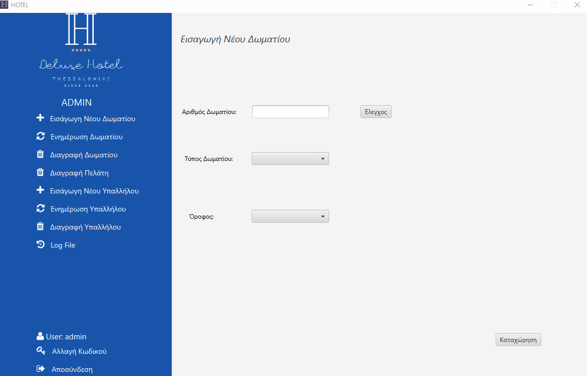
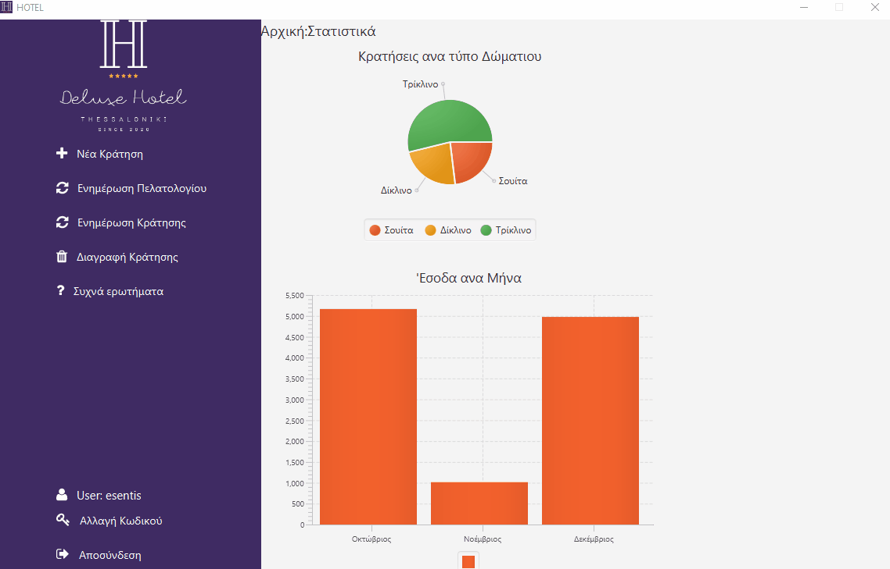

# Hotel Reservation System

>This project is an assignment for DBTech course of IHU.

## Getting started

**Front end :** 
**Back end :** 

This is a reservation manager used by the hotel reception to manage every aspect of the hotel.

### Screenshots

**Admin Panel**

**Staff Panel**

### API Documentation

For the backend we used **PostgreSQL** functions to add an abstraction level in our code.(And because it mandatory)

Below are all functions detailed.

#### Room

Get all rooms

    <pre>
CREATE OR REPLACE FUNCTION getrooms ()
    RETURNS TABLE (
        RoomId BIGINT,
        RoomNumber INT,
        Floor INT,
        Beds INT,
        RoomTypeId BIGINT
) 
AS $$
BEGIN
    RETURN QUERY  SELECT r."Id",r."RoomNumber", r."Floor", r0."Beds",r."RoomTypeId"
      FROM "Rooms" AS r
      LEFT JOIN "RoomTypes" AS r0 ON r."RoomTypeId" = r0."Id";
END; $$
LANGUAGE 'plpgsql';
    </pre>

 

Find room

    <pre>
CREATE OR REPLACE FUNCTION findroom (RoomNum INT) 
    RETURNS TABLE (
        Floor INT,
        RoomNumber INT,
        Beds INT
)
AS $$
BEGIN
    RETURN QUERY SELECT r."RoomNumber", r."Floor", r0."Beds"
      FROM "Rooms" AS r
      LEFT JOIN "RoomTypes" AS r0 ON r."RoomTypeId" = r0."Id"
      WHERE r."RoomNumber" = RoomNum
      LIMIT 1;
END; $$
LANGUAGE 'plpgsql';
    </pre>
   

Add a new room

    <pre>
CREATE OR REPLACE FUNCTION addroom (RoomFloor INT, RoomNumber INT, RoomTypeId BIGINT)
    RETURNS TABLE (
        Id BIGINT
)
AS $$
BEGIN
    RETURN QUERY INSERT INTO "Rooms" ("Floor", "RoomNumber", "RoomTypeId")
      VALUES (RoomFloor, RoomNumber, RoomTypeId)
      RETURNING "Id";
END; $$
LANGUAGE 'plpgsql';
    </pre>

Update room

    <pre>
CREATE OR REPLACE FUNCTION updateroom (RoomId BIGINT, FloorNumber INT, RoomNumber INT, RoomTypeId BIGINT)
    RETURNS void
AS $$
BEGIN
    UPDATE "Rooms" SET "Floor" = FloorNumber, "RoomNumber" = RoomNumber, "RoomTypeId" = RoomTypeId
      WHERE "Id" = RoomId;
END; $$
LANGUAGE 'plpgsql';
    </pre>

Get all free rooms

    <pre>
CREATE OR REPLACE FUNCTION getallfreerooms (CheckOutDate DATE, CheckInDate DATE) 
    RETURNS TABLE (
        RoomId BIGINT,
        FloorNumber INT,
        RoomNumber INT,
        Beds INT
) 
AS $$
BEGIN
    RETURN QUERY SELECT r."Id",r."Floor",r."RoomNumber",rt."Beds"
     FROM "Rooms" r JOIN "RoomTypes" rt on rt."Id"=r."RoomTypeId"
     WHERE r."Id" NOT IN
         (SELECT r0."Id"
          FROM "Reservations" AS r
          LEFT JOIN "Rooms" AS r0 ON r."RoomId" = r0."Id"
           WHERE not((r."CheckOutDate"<CheckInDate ::date) OR (r."CheckInDate">CheckOutDate ::date)));
END; $$
LANGUAGE 'plpgsql';
    </pre>

Get how many times a room has been reserved

    <pre>
CREATE OR REPLACE FUNCTION totalroomcheckins(RoomNum INT) 
    RETURNS TABLE (
        totalcheckins INT
)
AS $$
BEGIN
    RETURN QUERY SELECT COUNT(*)::INT
      FROM "ReservationOperationsLogs" AS r
      LEFT JOIN "Rooms" AS r0 ON r."RoomId" = r0."Id"
      WHERE (r."Operation" = 'I') AND (r0."RoomNumber" = RoomNum);
END; $$
LANGUAGE 'plpgsql';
    </pre>

Delete room with ID

    <pre>
CREATE OR REPLACE FUNCTION deleteroom (RoomId BIGINT)
    RETURNS void
AS $$
BEGIN
    DELETE FROM "Rooms"
      WHERE "Id" = RoomId;
END; $$
LANGUAGE 'plpgsql';
    </pre>

Delete room with room number

    <pre>
CREATE OR REPLACE FUNCTION deleteroomwithnumber (RoomNumber INT)
    RETURNS void
AS $$
BEGIN
    DELETE FROM "Rooms"
      WHERE "RoomNumber" = RoomNumber;
END; $$
LANGUAGE 'plpgsql';
    </pre>

Get a room's reservation status

    <pre>
CREATE OR REPLACE FUNCTION checkroomstatus (RoomId BIGINT) 
    RETURNS TABLE (
        ReservationId BIGINT,
        RoomNumber INT,
        firstName TEXT,
        lastName TEXT,
        checkInDate Date,
        checkOutDate Date,
        totalCost DECIMAL
)
AS $$
BEGIN
    RETURN QUERY SELECT r."Id", r0."RoomNumber", c."FirstName", c."LastName", r."CheckInDate"::date, r."CheckOutDate"::date, r."TotalCost"
      FROM "Reservations" AS r
      LEFT JOIN "Rooms" AS r0 ON r."RoomId" = r0."Id"
      LEFT JOIN "Customers" AS c ON r."CustomerId" = c."Id"
      WHERE r0."Id" = RoomId;
END; $$
LANGUAGE 'plpgsql';
    </pre>

#### Customer

Search customer

    <pre>
CREATE OR REPLACE FUNCTION searchcustomer (CustomerLastname TEXT, CustomerFirstName TEXT)
    RETURNS TABLE (
        Id BIGINT,
        Email TEXT,
        FirstName TEXT,
        LastName TEXT,
        PhoneNumber BIGINT
)
AS $$
BEGIN
    RETURN QUERY  SELECT c."Id", c."Email", c."FirstName", c."LastName", c."PhoneNumber"
      FROM "Customers" AS c
      WHERE ((upper(CustomerFirstName) = '') 
      OR (strpos(upper(c."FirstName"), upper(CustomerFirstName)) > 0)) 
      AND ((upper(CustomerLastname) = '') 
      OR (strpos(upper(c."LastName"), upper(CustomerLastname)) > 0));
END; $$
LANGUAGE 'plpgsql';
    </pre>
   

Add new customer

    <pre>
CREATE OR REPLACE FUNCTION addcustomer (Email TEXT, FirstName TEXT, LastName TEXT,PhoneNumber BIGINT) 
    RETURNS TABLE (
        Id BIGINT
)
AS $$
BEGIN
    RETURN QUERY  INSERT INTO "Customers" ("Email", "FirstName", "LastName", "PhoneNumber")
      VALUES (Email, FirstName,LastName,PhoneNumber )
      RETURNING "Id";
END; $$
LANGUAGE 'plpgsql';
    </pre>
   

Get all customers

    <pre>
CREATE OR REPLACE FUNCTION getcustomers() 
    RETURNS TABLE (
        Id BIGINT,
        email TEXT,
        firstName TEXT,
        lastName TEXT,
        phoneNumber BIGINT
)
AS $$
BEGIN
    RETURN QUERY  SELECT c."Id", c."Email", c."FirstName", c."LastName", c."PhoneNumber"
      FROM "Customers" AS c;
END; $$
LANGUAGE 'plpgsql';
    </pre>

Update a customer's information

    <pre>
CREATE OR REPLACE FUNCTION updateCustomer (CustomerId BIGINT, CustomerFirstName TEXT,CustomerLastName TEXT,CustomerEmail TEXT,CustomerPhoneNumber BIGINT) 
    RETURNS void
AS $$
BEGIN
    UPDATE "Customers" SET "Email" = CustomerEmail, "FirstName" = CustomerFirstName, "LastName" = CustomerLastName, "PhoneNumber" = CustomerPhoneNumber
      WHERE "Id" = CustomerId;
END; $$
LANGUAGE 'plpgsql';
    </pre>

Return a customer's unique ID

    <pre>
CREATE OR REPLACE FUNCTION getcustomerid (CustomerLastName TEXT, CustomerFirstName TEXT) 
    RETURNS TABLE (
        Id BIGINT
)
AS $$
BEGIN
    RETURN QUERY  SELECT c."Id"
      FROM "Customers" AS c
      WHERE (upper(c."FirstName") = upper(CustomerFirstName)) 
      AND (upper(c."LastName") = upper(CustomerLastName))
      LIMIT 1;
END; $$
LANGUAGE 'plpgsql';
    </pre>

Delete customer

    <pre>
CREATE OR REPLACE FUNCTION deletecustomer (CustomerId BIGINT)
    RETURNS void
AS $$
BEGIN
    DELETE FROM "Customers"
      WHERE "Id" = CustomerId;
END; $$
LANGUAGE 'plpgsql';
    </pre>

Get how many times a customer has reserved a room

    <pre>
CREATE OR REPLACE FUNCTION totalcustomercheckins(FirstName TEXT,LastName TEXT) 
    RETURNS TABLE (
        totalcheckins INT
)
AS $$
BEGIN
    RETURN QUERY SELECT COUNT(*)::INT
      FROM "ReservationOperationsLogs" AS r
      LEFT JOIN "Customers" AS c ON r."CustomerId" = c."Id"
      WHERE (r."Operation" = 'I') AND ((upper(c."FirstName") = upper(FirstName)) AND (upper(c."LastName") =upper(LastName)));
END; $$
LANGUAGE 'plpgsql';
    </pre>

#### Reservation

Add new reservation

    <pre>
CREATE OR REPLACE FUNCTION addreservation (CheckInDate DATE, CheckOutDate DATE, CustomerId BIGINT,RoomId BIGINT,TotalCost DECIMAL)
    RETURNS TABLE (
        Id BIGINT
)
AS $$
BEGIN
    RETURN QUERY INSERT INTO "Reservations" ("CheckInDate", "CheckOutDate", "CustomerId", "RoomId", "TotalCost")
      VALUES (CheckInDate ,CheckOutDate , CustomerId , RoomId , TotalCost)
      RETURNING "Id";
END; $$
LANGUAGE 'plpgsql';
    </pre>

Get all reservations

    <pre>
CREATE OR REPLACE FUNCTION getreservations()
    RETURNS TABLE (
        Id BIGINT,
        roomNumber INT,
        firstName TEXT,
        lastName TEXT,
        checkInDate DATE
        checkOutDate DATE
        totalCost DECIMAL
)
AS $$
BEGIN
    RETURN QUERY SELECT r."Id", r0."RoomNumber", c."FirstName", c."LastName", r."CheckInDate"::date, r."CheckOutDate"::date, r."TotalCost"
      FROM "Reservations" AS r
      LEFT JOIN "Rooms" AS r0 ON r."RoomId" = r0."Id"
      LEFT JOIN "Customers" AS c ON r."CustomerId" = c."Id";
END; $$
LANGUAGE 'plpgsql';
    </pre>

Search reservation

    <pre>
CREATE OR REPLACE FUNCTION searchreservation(CheckInDate DATE, CheckOutDate DATE)
    RETURNS TABLE (
        roomNumber INT,
        firstName TEXT,
        lastName TEXT
)
AS $$
BEGIN
    RETURN QUERY  SELECT r0."RoomNumber", c."FirstName", c."LastName"
      FROM "Reservations" AS r
      LEFT JOIN "Rooms" AS r0 ON r."RoomId" = r0."Id"
      LEFT JOIN "Customers" AS c ON r."CustomerId" = c."Id"
      WHERE not((r."CheckOutDate"< CheckInDate::date) OR (r."CheckInDate"> CheckOutDate::date));
END; $$
LANGUAGE 'plpgsql';
    </pre>

Search a reservation with customer's information

    <pre>
CREATE OR REPLACE FUNCTION searchspecificreservation (CustomerLastName TEXT, CustomerFirstName TEXT)
    RETURNS TABLE (
        ReservationId BIGINT,
        RoomNumber INT,
        firstName TEXT,
        lastName TEXT,
        checkInDate Date,
        checkOutDate Date,
        totalCost DECIMAL
)
AS $$
BEGIN
    RETURN QUERY SELECT r."Id", r0."RoomNumber", c."FirstName", c."LastName", r."CheckInDate"::Date, r."CheckOutDate"::Date, r."TotalCost"
      FROM "Reservations" AS r
      LEFT JOIN "Customers" AS c ON r."CustomerId" = c."Id"
      LEFT JOIN "Rooms" AS r0 ON r."RoomId" = r0."Id"
      WHERE ((upper(CustomerFirstName) = '')
      OR (strpos(upper(c."FirstName"),upper(CustomerFirstName)) > 0)) 
      AND ((upper(CustomerLastName) = '')
      OR (strpos(upper(c."LastName"), upper(CustomerLastName)) > 0));
END; $$
LANGUAGE 'plpgsql';
    </pre>

Get reservations from a specific customer

    <pre>
CREATE OR REPLACE FUNCTION searchspecificreservationwithid (CustomerId BIGINT)
    RETURNS TABLE (
        ReservationId BIGINT,
        RoomNumber INT,
        firstName TEXT,
        lastName TEXT,
        checkInDate TIMESTAMP,
        checkOutDate TIMESTAMP,
        totalCost DECIMAL
)
AS $$
BEGIN
    RETURN QUERY SELECT r."Id", r0."RoomNumber", c."FirstName", c."LastName", r."CheckInDate", r."CheckOutDate", r."TotalCost"
      FROM "Reservations" AS r
      LEFT JOIN "Customers" AS c ON r."CustomerId" = c."Id"
      LEFT JOIN "Rooms" AS r0 ON r."RoomId" = r0."Id"
      WHERE c."Id" = CustomerId;
END; $$
LANGUAGE 'plpgsql';
    </pre>

Update a reservation

    <pre>
CREATE OR REPLACE FUNCTION updatereservation (ReservationId BIGINT, CheckInDate DATE,CheckOutDate DATE,RoomId BIGINT,CustomerId BIGINT,TotalCost DECIMAL)
    RETURNS void
AS $$
BEGIN
    UPDATE "Reservations" SET "CheckInDate" = CheckInDate, "CheckOutDate" = CheckOutDate, "RoomId" = RoomId, "TotalCost" = TotalCost
      WHERE "Id" = ReservationId;
END; $$
LANGUAGE 'plpgsql';
    </pre>

Delete a reservation

    <pre>
CREATE OR REPLACE FUNCTION deletereservation (ReservationId BIGINT) 
    RETURNS void
AS $$
BEGIN
    DELETE FROM "Reservations"
      WHERE "Id" =ReservationId;
END; $$
LANGUAGE 'plpgsql';
    </pre>

Get all reservations that cost less than X

    <pre>
CREATE OR REPLACE FUNCTION reservationcostless (TotalCost DECIMAL) 
    RETURNS TABLE (
        ReservationId BIGINT,
        RoomNumber INT,
        firstName TEXT,
        lastName TEXT,
        checkInDate Date,
        checkOutDate Date,
        cost DECIMAL
)
AS $$
BEGIN
    RETURN QUERY SELECT r."Id", r0."RoomNumber", c."FirstName", c."LastName", r."CheckInDate"::date, r."CheckOutDate"::date, r."TotalCost"
      FROM "Reservations" AS r
      LEFT JOIN "Rooms" AS r0 ON r."RoomId" = r0."Id"
      LEFT JOIN "Customers" AS c ON r."CustomerId" = c."Id"
      WHERE r."TotalCost" < TotalCost;
END; $$
LANGUAGE 'plpgsql';
    </pre>

Get all reservations that cost more than X

    <pre>
CREATE OR REPLACE FUNCTION reservationcostmore (TotalCost DECIMAL)
    RETURNS TABLE (
        ReservationId BIGINT,
        RoomNumber INT,
        firstName TEXT,
        lastName TEXT,
        checkInDate Date,
        checkOutDate Date,
        cost DECIMAL
)
AS $$
BEGIN
    RETURN QUERY SELECT r."Id", r0."RoomNumber", c."FirstName", c."LastName", r."CheckInDate"::date, r."CheckOutDate"::date, r."TotalCost"
      FROM "Reservations" AS r
      LEFT JOIN "Rooms" AS r0 ON r."RoomId" = r0."Id"
      LEFT JOIN "Customers" AS c ON r."CustomerId" = c."Id"
      WHERE r."TotalCost" > TotalCost;
END; $$
LANGUAGE 'plpgsql';
    </pre>

Get all reservations within specific dates

    <pre>
CREATE OR REPLACE FUNCTION searchreservationcount(CheckInDate DATE, CheckOutDate DATE) 
    RETURNS TABLE (
        reservations INT
) 
AS $$
BEGIN
    RETURN QUERY SELECT COUNT(*)::INT
      FROM "Reservations" AS r
      WHERE not((r."CheckOutDate"< CheckInDate::date) OR (r."CheckInDate"> CheckOutDate::date));
END; $$
LANGUAGE 'plpgsql';
    </pre>

#### User

Add user

    <pre>
CREATE OR REPLACE FUNCTION addstaff (Email TEXT, FirstName TEXT, LastName TEXT, PasswordText TEXT, PhoneNumber BIGINT,RoleId BIGINT, UserName TEXT)
    RETURNS TABLE (
        Id BIGINT
)
AS $$
BEGIN
    RETURN QUERY INSERT INTO "Staffs" ("Email", "FirstName", "LastName", "Password", "PhoneNumber", "RoleId", "UserName")
      VALUES (Email, FirstName, LastName, PasswordText, PhoneNumber, RoleId, UserName)
      RETURNING "Id";
END; $$
LANGUAGE 'plpgsql';
    </pre>

Login user

    <pre>
CREATE OR REPLACE FUNCTION checkstaff (UserName TEXT, PasswordText TEXT)
    RETURNS TABLE (
        Id BIGINT,
        FirstName TEXT,
        LastName TEXT,
        UserNameText TEXT,
        RoleText TEXT,
        PhoneNumber BIGINT,
        Email TEXT
) 
AS $$
BEGIN
    RETURN QUERY SELECT s."Id", s."FirstName", s."LastName",s."UserName", s0."Role", s."PhoneNumber", s."Email"
      FROM "Staffs" AS s
      LEFT JOIN "StaffRoles" AS s0 ON s."RoleId" = s0."Id"
      WHERE (s."UserName" = UserName) AND (s."Password" = PasswordText)
      LIMIT 1;
END; $$
LANGUAGE 'plpgsql'
    </pre>

Get all users

    <pre>
CREATE OR REPLACE FUNCTION getallstaff ()
    RETURNS TABLE (
        Id BIGINT,
        FirstName TEXT,
        LastName TEXT,
        UserName TEXT,
        Password TEXT,
        RoleId BIGINT,
        PhoneNumber BIGINT,
        Email TEXT
)
AS $$
BEGIN
    RETURN QUERY SELECT s."Id", s."FirstName", s."LastName", s."UserName",s."Password",s."RoleId", s."PhoneNumber", s."Email"
      FROM "Staffs" AS s
      LEFT JOIN "StaffRoles" AS s0 ON s."RoleId" = s0."Id";
END; $$
LANGUAGE 'plpgsql';
    </pre>

Update a user's information

    <pre>
CREATE OR REPLACE FUNCTION updatestaff (StaffId BIGINT, FirstName TEXT,LastName TEXT,UserName TEXT,Email TEXT,PhoneNumber BIGINT,RoleId BIGINT) 
    RETURNS void
AS $$
BEGIN
    UPDATE "Staffs" SET "Email" = Email, "RoleId" = RoleId, "FirstName" = FirstName, "LastName" = LastName, "PhoneNumber" = PhoneNumber, "UserName" = UserName
      WHERE "Id" = StaffId;
END; $$
LANGUAGE 'plpgsql';
    </pre>

Update a user's password

    <pre>
CREATE OR REPLACE FUNCTION updatestaffpassword (StaffId BIGINT, NewPassword TEXT)
    RETURNS void
AS $$
BEGIN
    UPDATE "Staffs" SET "Password" = NewPassword
      WHERE "Id" = StaffId;
END; $$
LANGUAGE 'plpgsql';
    </pre>

#### Stats

Get reserved room types

    <pre>
CREATE OR REPLACE FUNCTION getreservedroomtypes ()
    RETURNS TABLE (
        TwoBeds INT,
        ThreeBeds INT,
        Suite INT
)
AS $$
BEGIN  
    twoBeds := (SELECT COUNT(*)::INT
      FROM "Reservations" AS r
      LEFT JOIN "Rooms" AS r0 ON r."RoomId" = r0."Id"
      LEFT JOIN "RoomTypes" AS r1 ON r0."RoomTypeId" = r1."Id"
      WHERE r1."Beds" = 2);
      threeBeds:= (SELECT COUNT(*)::INT
      FROM "Reservations" AS r
      LEFT JOIN "Rooms" AS r0 ON r."RoomId" = r0."Id"
      LEFT JOIN "RoomTypes" AS r1 ON r0."RoomTypeId" = r1."Id"
      WHERE r1."Beds" = 3);
      suite:= (SELECT COUNT(*)::INT
      FROM "Reservations" AS r
      LEFT JOIN "Rooms" AS r0 ON r."RoomId" = r0."Id"
      LEFT JOIN "RoomTypes" AS r1 ON r0."RoomTypeId" = r1."Id"
      WHERE r1."Beds" = 4);
      RETURN QUERY SELECT twoBeds,threeBeds,suite;
END; $$
LANGUAGE 'plpgsql';
    </pre>

Get reserved room types grouped

    <pre>
CREATE OR REPLACE FUNCTION getgroupedreservedroomtypes() 
    RETURNS TABLE (
        Beds INT,
        CheckIns BIGINT
)
AS $$
BEGIN  
      RETURN QUERY select r0."Beds",count(*)
from "Reservations" r join "Rooms" r1 on r."RoomId"=r1."Id" join "RoomTypes" r0 on r0."Id"=r1."RoomTypeId"
group by r0."Beds";
END; $$
LANGUAGE 'plpgsql';
    </pre>

Get check-ins by date

    <pre>
CREATE OR REPLACE FUNCTION checkinsbydate()
    RETURNS TABLE (
        checkInDate DATE,
        totalCheckIns BIGINT
)
AS $$
BEGIN  
      RETURN QUERY select r."CheckInDate"::date,count(*)
    from "Reservations" r
    group by r."CheckInDate";
END; $$
LANGUAGE 'plpgsql';
    </pre>

Get monthly income

    <pre>
CREATE OR REPLACE FUNCTION getincomepermonth() 
    RETURNS TABLE (
        checkingMonth TIMESTAMP,
        monthlySum DECIMAL
)
AS $$
BEGIN  
      RETURN QUERY SELECT date_trunc('month', "CheckInDate") AS checking_month, sum("TotalCost") as monthly_sum
     FROM "ReservationOperationsLogs" as r
     WHERE r."Operation" = 'I'
 GROUP BY checking_month
 ORDER BY checking_month;
END; $$
LANGUAGE 'plpgsql';
    </pre>

Get specific month's income

    <pre>
CREATE OR REPLACE FUNCTION getspecificmonthincone(monthToCheck INT) 
    RETURNS TABLE (
        checkingMonth TIMESTAMP,
        monthlySum DECIMAL
)
AS $$
BEGIN  
      RETURN QUERY SELECT date_trunc('month', "CheckInDate") AS checking_month, sum("TotalCost") as monthly_sum
     FROM "ReservationOperationsLogs" as r
     WHERE r."Operation" = 'I'
     AND date_part('month',"CheckInDate")::INT = monthToCheck
      GROUP BY checking_month;
END; $$
LANGUAGE 'plpgsql';
    </pre>

#### Log triggers

All customer operations

    <pre>
CREATE OR REPLACE FUNCTION process_customer_operations()
RETURNS TRIGGER AS $$
        BEGIN
        IF (TG_OP = 'DELETE') THEN
            INSERT INTO "CustomerOperationsLogs" SELECT 'D', now(),(SELECT s."UserName"
      FROM "Staffs" AS s
      WHERE s."Status" = 1
      LIMIT 1), OLD.*;
        RETURN OLD;
        ELSIF (TG_OP = 'UPDATE') THEN
        INSERT INTO "CustomerOperationsLogs" SELECT 'U', now(),( SELECT s."UserName"
      FROM "Staffs" AS s
      WHERE s."Status" = 1
      LIMIT 1), NEW.*;
        RETURN NEW;
        ELSIF (TG_OP = 'INSERT') THEN
            INSERT INTO "CustomerOperationsLogs" SELECT 'I', now(), (SELECT s."UserName"
      FROM "Staffs" AS s
      WHERE s."Status" = 1
      LIMIT 1), NEW.*;
            RETURN NEW;
        END IF;
        RETURN NULL;
    END;
$$
LANGUAGE plpgsql;
CREATE TRIGGER customer_audit
AFTER INSERT OR UPDATE OR DELETE ON "Customers"
    FOR EACH ROW EXECUTE PROCEDURE process_customer_operations();
    </pre>

All room operations

    <pre>
CREATE OR REPLACE FUNCTION process_room_operations()
RETURNS TRIGGER AS $$
        BEGIN
        IF (TG_OP = 'DELETE') THEN
            INSERT INTO "RoomOperationsLogs" SELECT 'D', now(),(SELECT s."UserName"
      FROM "Staffs" AS s
      WHERE s."Status" = 1
      LIMIT 1), OLD.*;
            RETURN OLD;
        ELSIF (TG_OP = 'UPDATE') THEN
            INSERT INTO "RoomOperationsLogs" SELECT 'U', now(),( SELECT s."UserName"
      FROM "Staffs" AS s
      WHERE s."Status" = 1
      LIMIT 1), NEW.*;
            RETURN NEW;
        ELSIF (TG_OP = 'INSERT') THEN
            INSERT INTO "RoomOperationsLogs" SELECT 'I', now(), (SELECT s."UserName"
      FROM "Staffs" AS s
      WHERE s."Status" = 1
      LIMIT 1), NEW.*;
            RETURN NEW;
        END IF;
        RETURN NULL;
    END;
$$
LANGUAGE plpgsql;
CREATE TRIGGER room_audit
AFTER INSERT OR UPDATE OR DELETE ON "Rooms"
    FOR EACH ROW EXECUTE PROCEDURE process_room_operations();
    </pre>

All reservation operations

    <pre>
CREATE OR REPLACE FUNCTION process_reservation_operations()
RETURNS TRIGGER AS $$
    BEGIN
        IF (TG_OP = 'DELETE') THEN
            INSERT INTO "ReservationOperationsLogs" SELECT 'D', now(),(SELECT s."UserName"
      FROM "Staffs" AS s
      WHERE s."Status" = 1
      LIMIT 1), OLD.*;
            RETURN OLD;
        ELSIF (TG_OP = 'UPDATE') THEN
            INSERT INTO "ReservationOperationsLogs" SELECT 'U', now(),( SELECT s."UserName"
      FROM "Staffs" AS s
      WHERE s."Status" = 1
      LIMIT 1), NEW.*;
            RETURN NEW;
        ELSIF (TG_OP = 'INSERT') THEN
            INSERT INTO "ReservationOperationsLogs" SELECT 'I', now(), (SELECT s."UserName"
      FROM "Staffs" AS s
      WHERE s."Status" = 1
      LIMIT 1), NEW.*;
            RETURN NEW;
        END IF;
        RETURN NULL;
    END;
$$
LANGUAGE plpgsql;
CREATE TRIGGER reservation_audit
AFTER INSERT OR UPDATE OR DELETE ON "Reservations"
    FOR EACH ROW EXECUTE PROCEDURE process_reservation_operations();
    </pre>

All staff operations

    <pre>
CREATE OR REPLACE FUNCTION process_staff_operations()
RETURNS TRIGGER AS $$
        BEGIN
        IF (TG_OP = 'DELETE') THEN
            INSERT INTO "StaffOperationsLogs" SELECT 'D', now(),(SELECT s."UserName"
      FROM "Staffs" AS s
      WHERE s."Status" = 1
      LIMIT 1), OLD.*;
            RETURN OLD;
        ELSIF (TG_OP = 'UPDATE') THEN
            INSERT INTO "StaffOperationsLogs" SELECT 'U', now(),( SELECT s."UserName"
      FROM "Staffs" AS s
      WHERE s."Status" = 1
      LIMIT 1), NEW.*;
            RETURN NEW;
        ELSIF (TG_OP = 'INSERT') THEN
            INSERT INTO "StaffOperationsLogs" SELECT 'I', now(), (SELECT s."UserName"
      FROM "Staffs" AS s
      WHERE s."Status" = 1
      LIMIT 1), NEW.*;
            RETURN NEW;
        END IF;
        RETURN NULL;
    END;
$$
LANGUAGE plpgsql;
CREATE TRIGGER staff_audit
AFTER INSERT OR UPDATE OR DELETE ON "Staffs"
    FOR EACH ROW EXECUTE PROCEDURE process_staff_operations();
    </pre>

